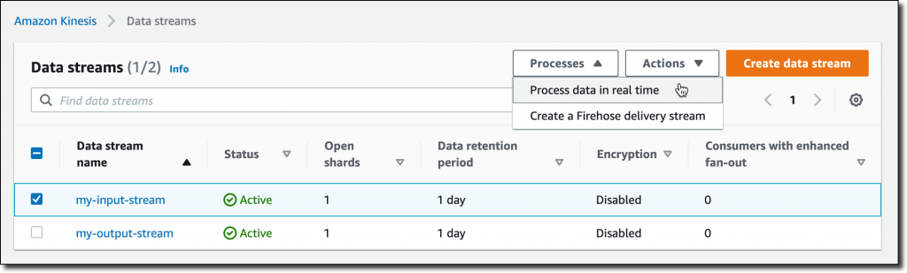
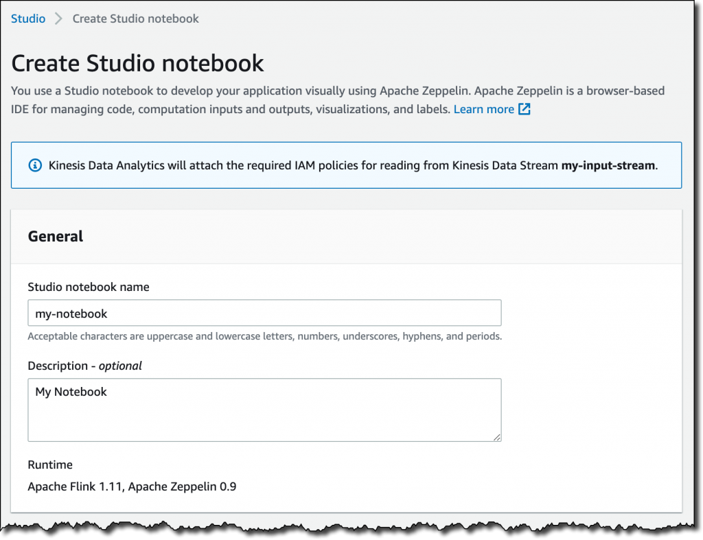
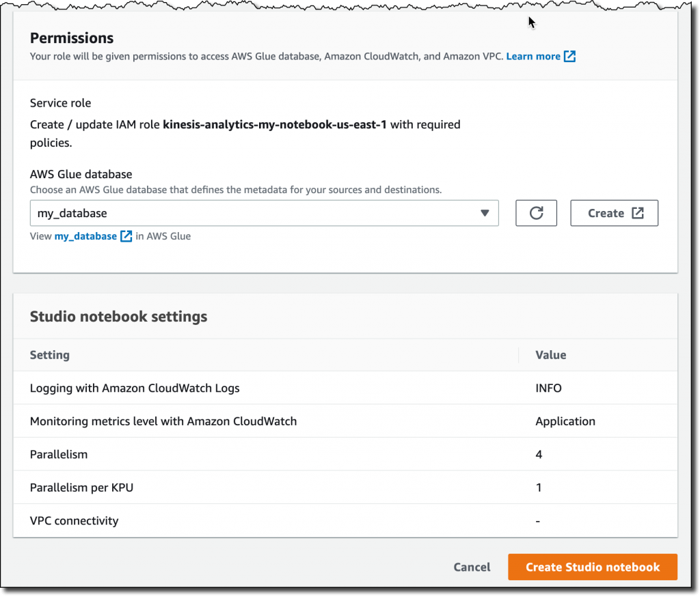
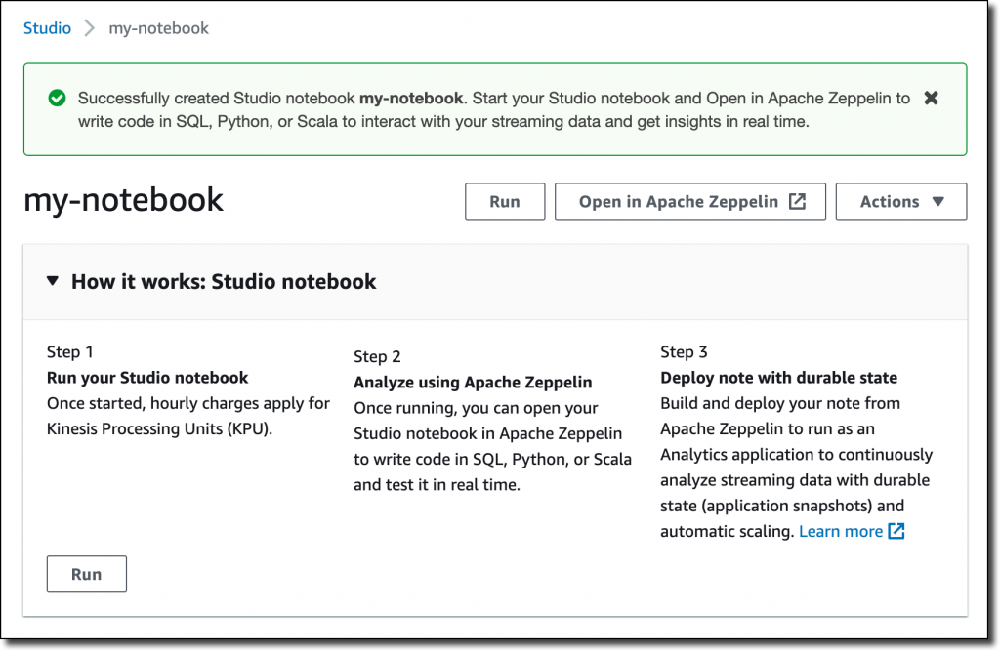
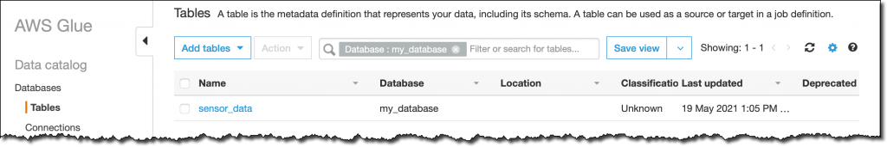
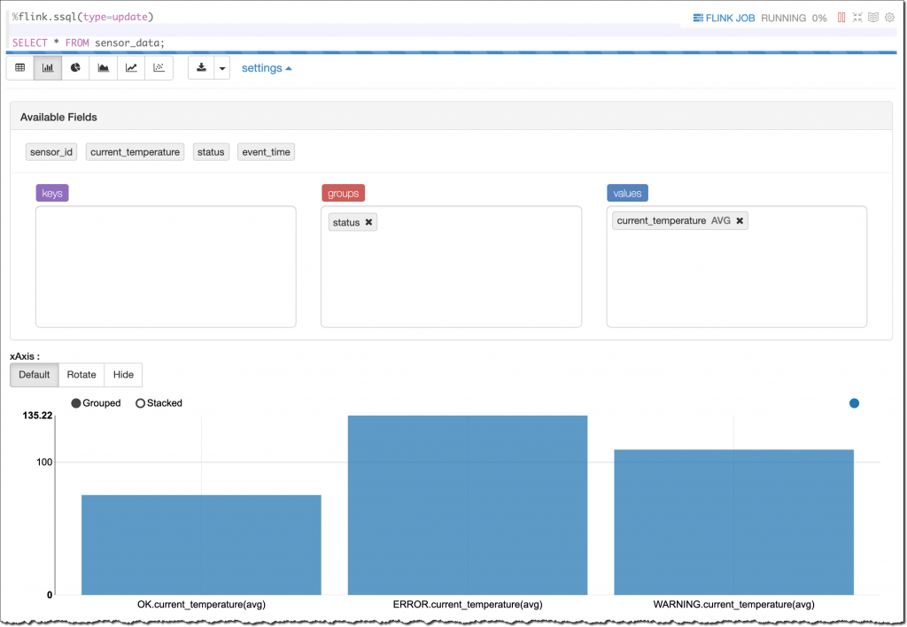
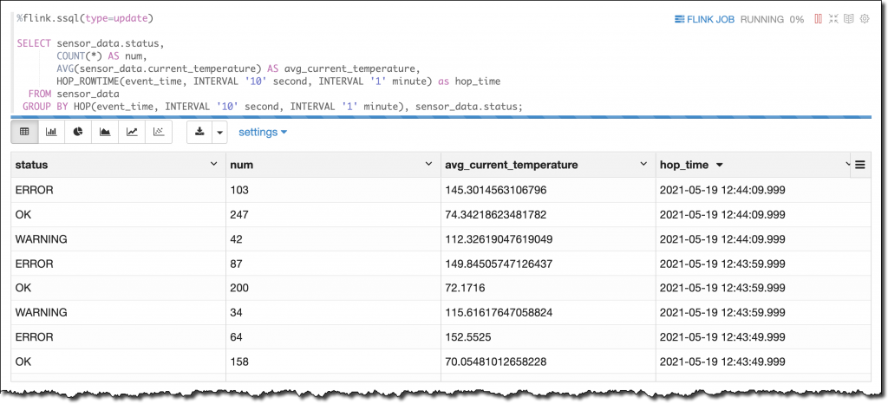
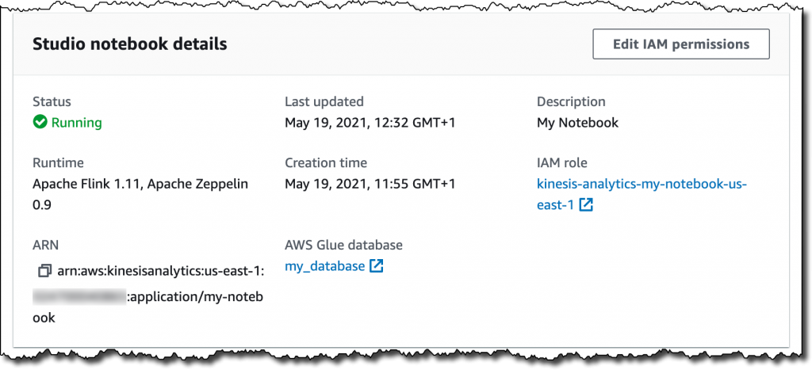
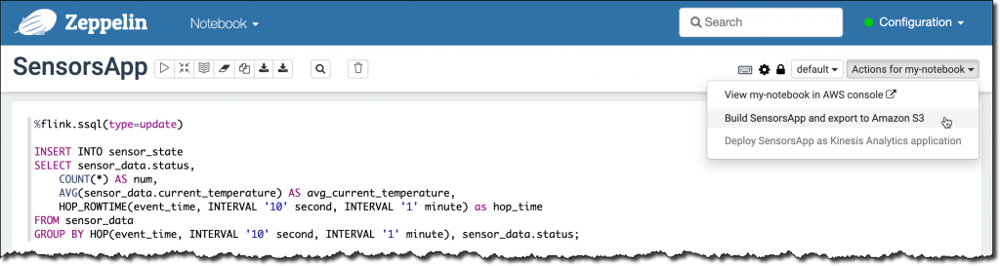

# Getting started with Kinesis Data Analytics Studio

## Step 1
1. Create a Cloud9 environment with all the default settings. https://console.aws.amazon.com/cloud9
2. Create an IAM role with full access to Kinesis Data Streams (AmazonKinesisFullAccess). For test purpose you can also use the default Admin policy (Select EC2 as service while creating the role).
3. Add the role to your Cloud9 environment as decribed here: https://track-and-trace-blockchain.workshop.aws/00-prerequisites/03-attach-machine-role.html
4. install boto3 in your Cloud9 environment
```
pip install boto3
```

## Step 2 - working with Kinesis Data Streams
1. Create a new Kinesis Data Streams https://console.aws.amazon.com/kinesis
Data stream name: my-input-stream
Number of open shards: 2

2. Open the Cloud9 IDE
3. crate a new file from Cloud9 IDE "random_data_generator.py"
4. Enter the below python code

```
import datetime
import json
import random
import boto3

STREAM_NAME = "my-input-stream"


def get_random_data():
    current_temperature = round(10 + random.random() * 170, 2)
    if current_temperature > 160:
        status = "ERROR"
    elif current_temperature > 140 or random.randrange(1, 100) > 80:
        status = random.choice(["WARNING","ERROR"])
    else:
        status = "OK"
    return {
        'sensor_id': random.randrange(1, 100),
        'current_temperature': current_temperature,
        'status': status,
        'event_time': datetime.datetime.now().isoformat()
    }


def send_data(stream_name, kinesis_client):
    while True:
        data = get_random_data()
        partition_key = str(data["sensor_id"])
        print(data)
        kinesis_client.put_record(
            StreamName=stream_name,
            Data=json.dumps(data),
            PartitionKey=partition_key)


if __name__ == '__main__':
    kinesis_client = boto3.client('kinesis')
    send_data(STREAM_NAME, kinesis_client)
    
```
5. run below command in Cloud9 terminal
```
python random_data_generator.py
```


This script sends random records to my Kinesis data stream using JSON syntax. For example:
```
{'sensor_id': 77, 'current_temperature': 93.11, 'status': 'OK', 'event_time': '2021-05-19T11:20:00.978328'}
{'sensor_id': 47, 'current_temperature': 168.32, 'status': 'ERROR', 'event_time': '2021-05-19T11:20:01.110236'}
{'sensor_id': 9, 'current_temperature': 140.93, 'status': 'WARNING', 'event_time': '2021-05-19T11:20:01.243881'}
{'sensor_id': 27, 'current_temperature': 130.41, 'status': 'OK', 'event_time': '2021-05-19T11:20:01.371191'}
```


From the Kinesis console, I select a Kinesis data stream (my-input-stream) and choose Process data in real time from the Process drop-down. In this way, the stream is configured as a source for the notebook.



Then, in the following dialog box, I create an Apache Flink – Studio notebook.

I enter a name (my-notebook) and a description for the notebook. The AWS Identity and Access Management (IAM) permissions to read from the Kinesis data stream I selected earlier (my-input-stream) are automatically attached to the IAM role assumed by the notebook.



I choose Create to open the AWS Glue console and create an empty database. Back in the Kinesis Data Analytics Studio console, I refresh the list and select the new database. It will define the metadata for my sources and destinations. From here, I can also review the default Studio notebook settings. Then, I choose Create Studio notebook.



Now that the notebook has been created, I choose Run.



When the notebook is running, I choose Open in Apache Zeppelin to get access to the notebook and write code in SQL, Python, or Scala to interact with my streaming data and get insights in real time.

In the notebook, I create a new note and call it Sensors. Then, I create a sensor_data table describing the format of the data in the stream:

```
%flink.ssql

CREATE TABLE sensor_data (
    sensor_id INTEGER,
    current_temperature DOUBLE,
    status VARCHAR(6),
    event_time TIMESTAMP(3),
    WATERMARK FOR event_time AS event_time - INTERVAL '5' SECOND
)
PARTITIONED BY (sensor_id)
WITH (
    'connector' = 'kinesis',
    'stream' = 'my-input-stream',
    'aws.region' = 'us-east-1',
    'scan.stream.initpos' = 'LATEST',
    'format' = 'json',
    'json.timestamp-format.standard' = 'ISO-8601'
)
```

The first line in the previous command tells to Apache Zeppelin to provide a stream SQL environment (%flink.ssql) for the Apache Flink interpreter. I can also interact with the streaming data using a batch SQL environment (%flink.bsql), or Python (%flink.pyflink) or Scala (%flink) code.

The first part of the CREATE TABLE statement is familiar to anyone who has used SQL with a database. A table is created to store the sensor data in the stream. The WATERMARK option is used to measure progress in the event time, as described in the Event Time and Watermarks section of the Apache Flink documentation.

The second part of the CREATE TABLE statement describes the connector used to receive data in the table (for example, kinesis or kafka), the name of the stream, the AWS Region, the overall data format of the stream (such as json or csv), and the syntax used for timestamps (in this case, ISO 8601). I can also choose the starting position to process the stream, I am using LATEST to read the most recent data first.

When the table is ready, I find it in the AWS Glue Data Catalog database I selected when I created the notebook:

Console screenshot.

Now I can run SQL queries on the sensor_data table and use sliding or tumbling windows to get a better understanding of what is happening with my sensors.

For an overview of the data in the stream, I start with a simple SELECT to get all the content of the sensor_data table:

```
%flink.ssql(type=update)

SELECT * FROM sensor_data;
```
This time the first line of the command has a parameter (type=update) so that the output of the SELECT, which is more than one row, is continuously updated when new data arrives.

On the terminal of my laptop, I start the random_data_generator.py script:

$ python3 random_data_generator.py
At first I see a table that contains the data as it comes. To get a better understanding, I select a bar graph view. Then, I group the results by status to see their average current_temperature, as shown here:



As expected by the way I am generating these results, I have different average temperatures depending on the status (OK, WARNING, or ERROR). The higher the temperature, the greater the probability that something is not working correctly with my sensors.

I can run the aggregated query explicitly using a SQL syntax. This time, I want the result computed on a sliding window of 1 minute with results updated every 10 seconds. To do so, I am using the HOP function in the GROUP BY section of the SELECT statement. To add the time to the output of the select, I use the HOP_ROWTIME function. For more information, see how group window aggregations work in the Apache Flink documentation.

```
%flink.ssql(type=update)

SELECT sensor_data.status,
       COUNT(*) AS num,
       AVG(sensor_data.current_temperature) AS avg_current_temperature,
       HOP_ROWTIME(event_time, INTERVAL '10' second, INTERVAL '1' minute) as hop_time
  FROM sensor_data
 GROUP BY HOP(event_time, INTERVAL '10' second, INTERVAL '1' minute), sensor_data.status;

```

This time, I look at the results in table format:



To send the result of the query to a destination stream, I create a table and connect the table to the stream. First, I need to give permissions to the notebook to write into the stream.

In the Kinesis Data Analytics Studio console, I select my-notebook. Then, in the Studio notebooks details section, I choose Edit IAM permissions. Here, I can configure the sources and destinations used by the notebook and the IAM role permissions are updated automatically.



In the Included destinations in IAM policy section, I choose the destination and select my-output-stream. I save changes and wait for the notebook to be updated. I am now ready to use the destination stream.

In the notebook, I create a sensor_state table connected to my-output-stream.

```
%flink.ssql

CREATE TABLE sensor_state (
    status VARCHAR(6),
    num INTEGER,
    avg_current_temperature DOUBLE,
    hop_time TIMESTAMP(3)
)
WITH (
'connector' = 'kinesis',
'stream' = 'my-output-stream',
'aws.region' = 'us-east-1',
'scan.stream.initpos' = 'LATEST',
'format' = 'json',
'json.timestamp-format.standard' = 'ISO-8601');
```
I now use this INSERT INTO statement to continuously insert the result of the select into the sensor_state table.

```
%flink.ssql(type=update)

INSERT INTO sensor_state
SELECT sensor_data.status,
    COUNT(*) AS num,
    AVG(sensor_data.current_temperature) AS avg_current_temperature,
    HOP_ROWTIME(event_time, INTERVAL '10' second, INTERVAL '1' minute) as hop_time
FROM sensor_data
GROUP BY HOP(event_time, INTERVAL '10' second, INTERVAL '1' minute), sensor_data.status;
```

The data is also sent to the destination Kinesis data stream (my-output-stream) so that it can be used by other applications. For example, the data in the destination stream can be used to update a real-time dashboard, or to monitor the behavior of my sensors after a software update.

I am satisfied with the result. I want to deploy this query and its output as a Kinesis Analytics application.

First, I create a SensorsApp note in my notebook and copy the statements that I want to execute as part of the application. The tables have already been created, so I just copy the INSERT INTO statement above.

Then, from the menu at the top right of my notebook, I choose Build SensorsApp and export to Amazon S3 and confirm the application name.



When the export is ready, I choose Deploy SensorsApp as Kinesis Analytics application in the same menu. After that, I fine-tune the configuration of the application. I set parallelism to 1 because I have only one shard in my input Kinesis data stream and not a lot of traffic. Then, I run the application, without having to write any code.

From the Kinesis Data Analytics applications console, I choose Open Apache Flink dashboard to get more information about the execution of my application.


